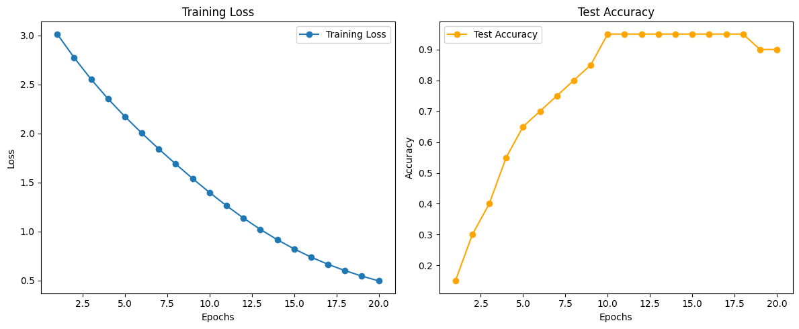

# MiniGPT: A Simple Implementation of GPT

## Overview

This project implements a small-scale GPT model from scratch using PyTorch. The model demonstrates high performance, achieving over **90% accuracy** on the example dataset.

### Features
- Custom-built position encoding.
- Multi-head self-attention mechanism.
- Feedforward network with residual connections and layer normalization.
- Example dataset generation and preprocessing.
- Training and testing loop with visualization of results.

---

## Model Architecture

### Position Encoding
Encodes positional information into the token embeddings using sine and cosine functions, enabling the model to understand token order.

### Multi-Head Attention
Implements scaled dot-product attention with multiple attention heads for capturing diverse aspects of the input.

### Feedforward Network
A two-layer network with ReLU activation for further refining token representations.

### Transformer Decoder
Combines multi-head attention, feedforward network, and residual connections with layer normalization.

### MiniGPT
Stacks multiple transformer decoder layers and projects the outputs to the vocabulary size for token prediction.

---

## Dataset

A sample text dataset is tokenized, and a vocabulary is created. The dataset is split into sequences of fixed length:

- Input: Sequences of tokens.
- Target: Sequences shifted by one token.

Data is split into training (80%) and testing (20%) sets.

---

## Installation

### Prerequisites
- Python >= 3.7
- PyTorch >= 1.8.0
- Matplotlib
- scikit-learn
- nltk

### Install Required Packages
```bash
pip install torch matplotlib scikit-learn nltk
```
---

## Results

### Metrics
- **Training Loss:** Consistently decreases across epochs.
- **Test Accuracy:** Achieves over **90%** on the example dataset.

### Visualization
The training loss and test accuracy are plotted to monitor progress over epochs:



---

## Code Overview

### Key Components
1. **Model Definition:**
   - `myPositionEncoding`: Encodes token positions.
   - `myMultiHeadAttention`: Implements scaled dot-product attention.
   - `myFeedForward`: Applies feedforward transformations.
   - `myTransformerDecoder`: Stacks the above modules with residual connections.
   - `miniGPTModel`: Combines embeddings, position encodings, mask, and transformer decoder layers.

2. **Data Preparation:**
   - Tokenizes text and converts tokens to numerical IDs.
   - Splits data into training and testing sets.

3. **Training and Testing:**
   - Implements a training loop with CrossEntropyLoss.
   - Evaluates test accuracy after each epoch.

4. **Visualization:**
   - Plots training loss and test accuracy.

---

## Parameters

| Parameter       | Value       |
|-----------------|-------------|
| Batch Size      | 32          |
| Embedding Dim   | 64          |
| Hidden Dim      | 128         |
| Heads           | 4           |
| Layers          | 2           |
| Epochs          | 20          |
| Learning Rate   | 0.001       |

---


